# BoylerCut

BoylerCut is a free video clip editor for Windows. Pick a recording, cut it, add effects, render it and drag the file straight into Discord. Everything runs on your own PC: no account, and nothing is uploaded.

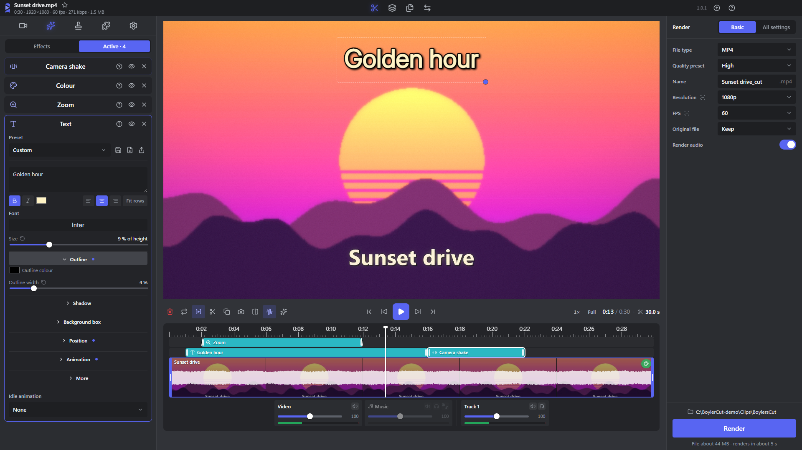
*Simple mode: one clip, its effects on the strip, an effect's sliders at the side and the render settings on the right.*

## Features

- **Four modes:** Simple cuts one clip, Advanced is a timeline for many clips, Batch renders many clips with the same settings, and Convert turns files into another video, sound or picture type.

  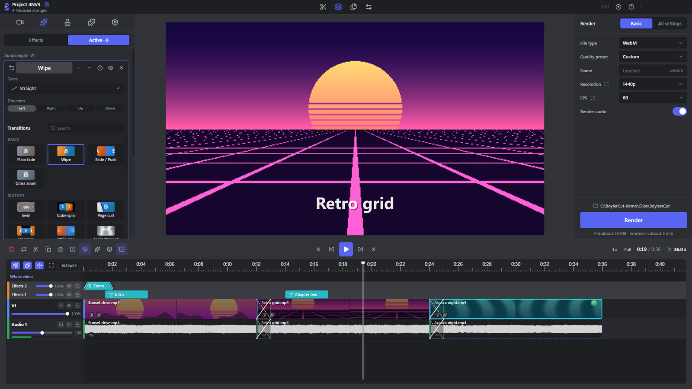
  *Advanced: clips on a timeline with transitions between them, text on top and a volume slider for every track.*

  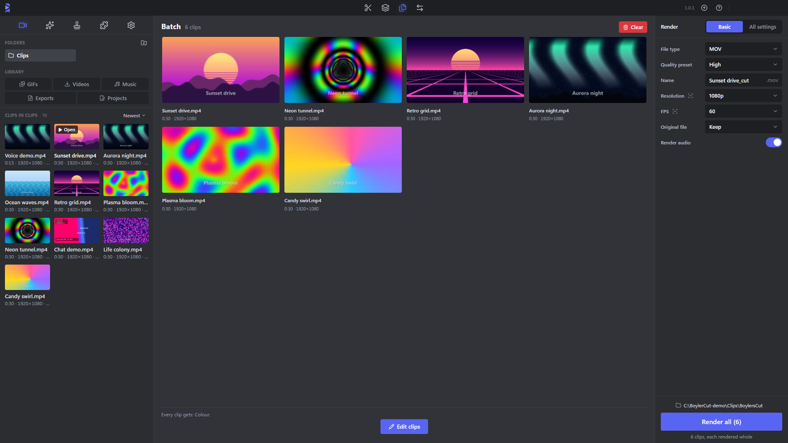
  *Batch: many clips in one list, the same effects and render settings for all of them.*

  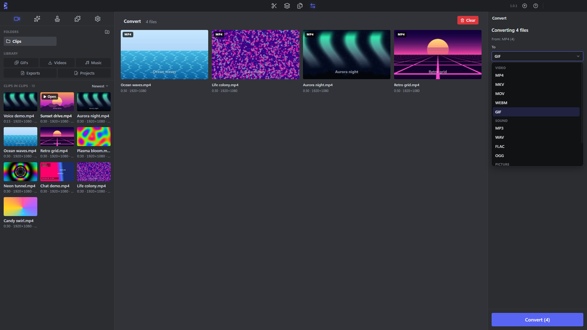
  *Convert: pick the files and the type to turn them into - video, sound or picture.*
- **Your clips at a glance:** open the folder you record into and rest the pointer on a clip to play it, or open the big clips view to see them all, grouped by day. Drag clips and finished renders straight into Discord, Explorer or any app.
- **Quick cutting:** trim the start and end, cut a clip into pieces, take pieces out, mute a stretch, and fade anything in or out.
- **Effects** for the picture and the sound: Colour (with LUTs), Speed, Reverse, Crop, Zoom, Text, Blur box, Pixelate, Camera shake, Freeze frame, Equalizer, Compressor and many more.

  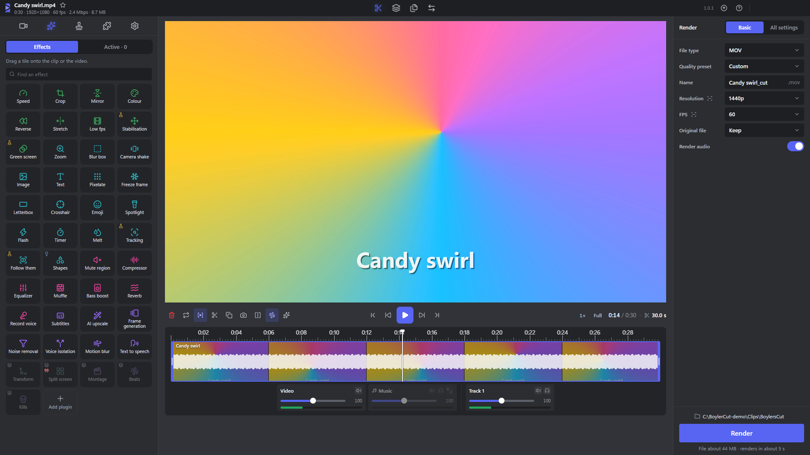
  *The Effects list: every picture and sound effect, ready to drag onto a clip.*

  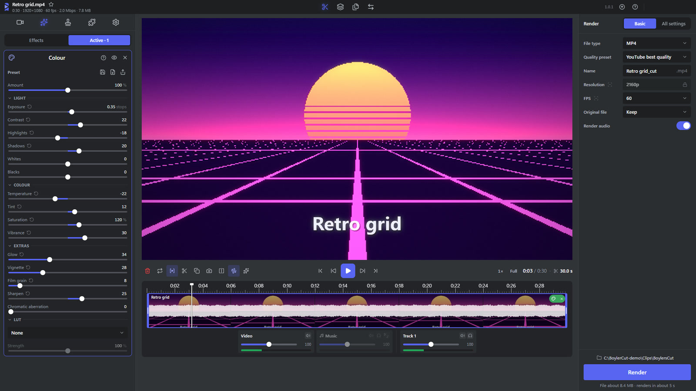
  *Colour: sliders for light and colour, extras and LUTs, with the result in the player as you move them.*

  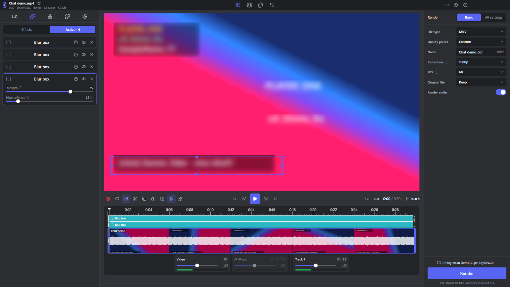
  *Blur box: draw a box over a name, chat or a notification and it is blurred.*
- **Keyframes:** text, emoji, pictures, timers, blur boxes, zooms and crops can move, grow and turn over time.
- **Transitions** between clips in Advanced: wipes, slides, cross zoom, cube spin, page curl, glitch and many more.
- **Templates:** save your effects, text, song and mixer as a template with a picture, and put them on the next clip in one click - or let a start template go on every new clip.

  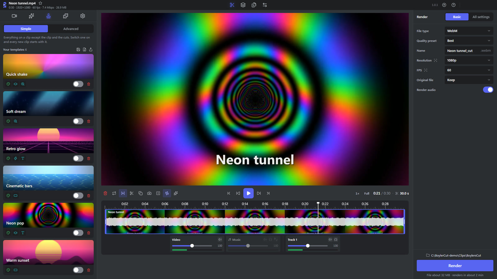
  *Templates: each one has a picture, and puts its effects, text, song and mixer on the next clip in one click.*
- **Music and sound:** a mixer that plays every audio track of your recording, a song under your clip, and a song's sound from a link as mp3.
- **Downloads:** paste a video link and it is saved as mp4, ready to edit.
- **AI tools that run on your PC:** Subtitles, Text to speech, Noise removal, Voice isolation, Frame generation, Motion blur, AI upscale and Tracking. Their models download from the Add-ons page only when you want them.

  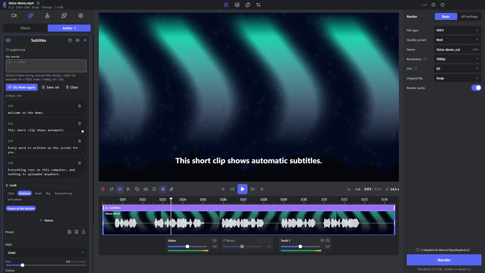
  *Subtitles: the words are written from the sound, shown on the picture and open to edit.*

  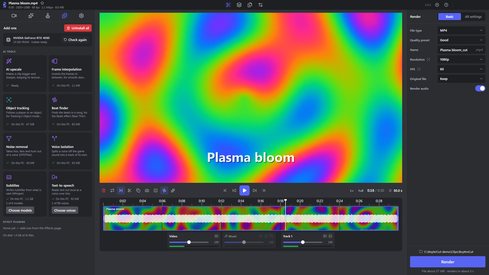
  *The Add-ons page: each AI tool, whether it is on your PC, and a button to get it.*
- **Discord-size renders:** Discord lite and Discord best fit your Discord plan's limit (20 MB, 50 MB, 500 MB or 1 GB). Also MP4, MOV, MKV, WebM, GIF, MP3 and WAV, up to 4K 60 fps for YouTube.

  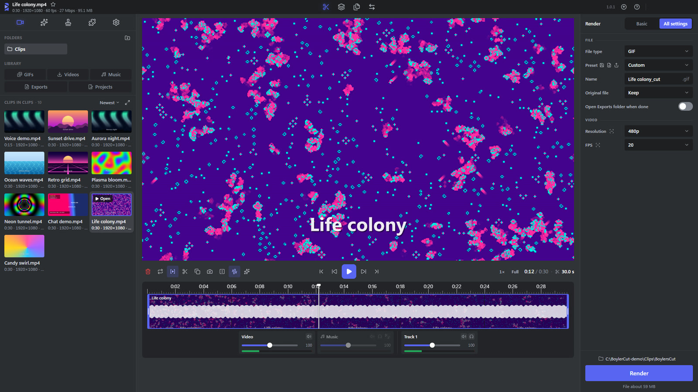
  *Render settings: file type, size and frame rate, shown here for a GIF.*
- **Your work is kept:** close the app and it opens where you left off; save projects as files, with undo history. 22 themes, and your own colour.

## Install

1. Open [Releases](../../releases) and download the newest `BoylerCut-Setup-<version>.exe`.
2. Run it.
3. Windows shows "Windows protected your PC", because the app is not signed. Click **More info**, then **Run anyway**.

## Updates

The app looks for a new version when it starts. When one is out, the update icon in the top bar lights up: click it to download the update, then click it again to restart and install it.

Older 0.x installs are offered 1.0.0 by their own update button, and from then on they get their updates from here.

## System needs

- Windows 10 or 11, 64-bit.
- About 700 MB of disk space for the app, plus about 220 MB for the installer while you download it.
- The AI tools are extra downloads, each one only when you want it: from about 1 MB to about 1.1 GB (the largest Subtitles model). Everything on the Add-ons page together is about 5 GB.
- A graphics card: Frame generation and AI upscale need one with Vulkan, and AI upscale's RTX Video needs an NVIDIA RTX card. Renders use the graphics card's encoder, and if it fails they finish on the processor by themselves. The Add-ons page rates each tool for your PC.
- The internet only for downloading videos, AI tools and updates; editing works offline.

## Licence

BoylerCut is free to download and use. Its code is not open source - all rights reserved. Parts that ship inside it (FFmpeg, yt-dlp and others) keep their own licences.
